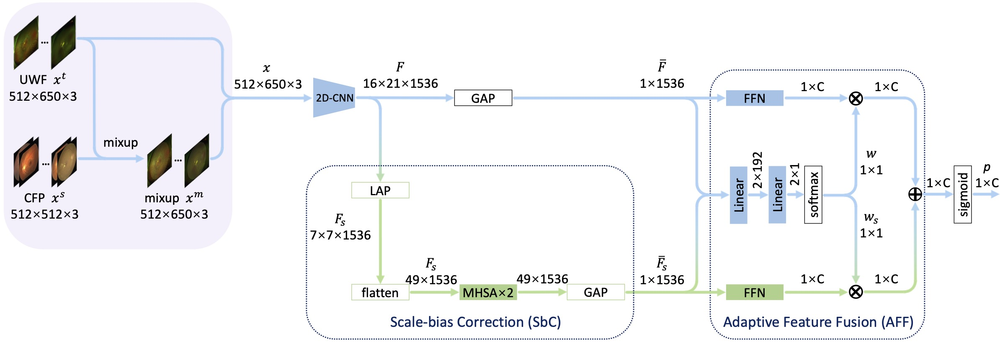

# Cross-domain Collaborative Learning (CdCL)
Code for our BIBM2023 paper [Supervised Domain Adaptation for Recognizing Retinal Diseases from Wide-Field Fundus Images](https://arxiv.org/abs/2305.08078)




# Get started

## Environment
Install packages by `pip install -r requirements.txt`. This step is suggested to be done in your docker container or virtual environment or things like that. 

## Datasets
- RFMiD: [https://ieee-dataport.org/open-access/retinal-fundus-multi-disease-image-dataset-rfmid](https://ieee-dataport.org/open-access/retinal-fundus-multi-disease-image-dataset-rfmid)
- TOP: [https://github.com/DateCazuki/Fundus_Diagnosis](https://github.com/DateCazuki/Fundus_Diagnosis)


## Data preparation
It is recommended to crop the RFMiD images into squares by using
```
python tools/RFMiD_dataset/square.py
```

## Data Organization
The images are organized as follows:
```
imagedata/  
├── RFMiD/
│   ├── train_1.jpg
│   ├── train_2.jpg
│   ├── ...
│   ├── val_1.jpg
│   ├── val_2.jpg
│   ├── ...
│   ├── test_1.jpg
│   ├── test_2.jpg
│   └── ...
└── TOP/
    ├── 000000_00.jpg
    ├── 000000_01.jpg
    ├── 000001_00.jpg
    └── ...
```

The annotations are organized as follows:
```
Annotations/
├── test_RFMiD/
│   └── Annotations/
│       └── anno.txt
├── test_TOP/
├── train_RFMiD/
├── train_TOP/
├── val_RFMiD/
└── val_TOP/
```

 
## Codes
Try `sh main.sh` which combines training, predicting and evaluating together. 

# Citation
If you find this our work useful, please consider citing:
```
@inproceedings{wei2023cdcl,
  title={Supervised Domain Adaptation for Recognizing Retinal Diseases from Wide-Field Fundus Images},
  author={Wei, Qijie and Yang, Jingyuan and Wang, Bo and Wang, Jinrui and Zhao, Jianchun and Zhao, Xinyu and Yang, Sheng and Manivannan, Niranchana and Chen, Youxin and Ding, Dayong and Zhou, Jing and Li, Xirong},
  booktitle={2023 IEEE International Conference on Bioinformatics and Biomedicine (BIBM)},
  year={2023}
}
```

# Contact
If you encounter any issue when running the code, please feel free to reach us either by creating a new issue in the GitHub or by emailing

+ Qijie Wei (qijie.wei@ruc.edu.cn)